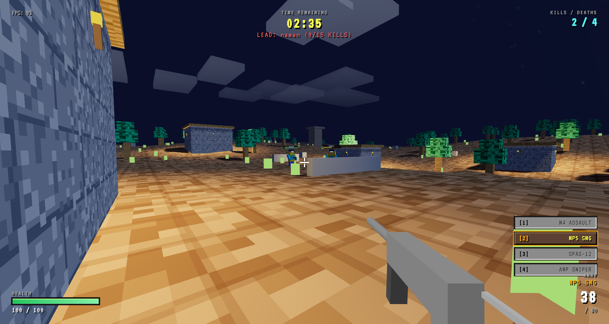

<h1 align="center"> VOXELSTRIKE</h1>

  <em>Survive the <b>Zombie Apocalypse</b> along with an immersive Online Multiplayer PVP Deathmatch</em>

  

  

---

##  About the Project

**VOXELSTRIKE** is an immersive **3D virtual battleground** that brings the fun of both **Zombie Apocalypse** and **Online multiplayer Battle** to life.  
Built using **Three.js** and **Peer.js** this project allows users to experience Zombie Apocalypse and the fun of Online Multiplayer PVP Deathmatch.

---

##  Preview

  
  

<h3 align="center"> Created by the <b>ISTE Team</b> — BIT Sindri </h3>

  

